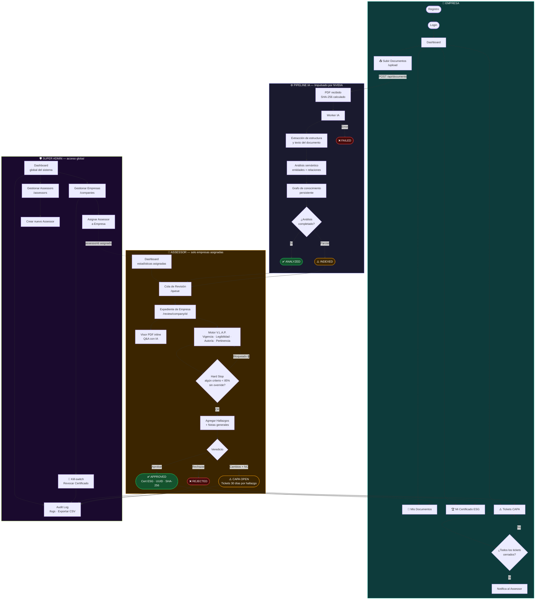

# CETIEM — Flujo del Sistema

Diagrama completo de los tres perfiles y el pipeline de IA.

---

---

## Tabla de acceso por rol

| Acción | 🏢 Empresa | 👤 Assessor | 🛡️ Admin |
|--------|-----------|-------------|---------|
| Subir documentos | ✅ | ❌ | ❌ |
| Ver sus propios documentos | ✅ | — | ✅ |
| Ver documentos de empresas asignadas | ❌ | ✅ | ✅ |
| Reprocesar documentos | ❌ | ✅ (asignadas) | ✅ |
| Q&A / Grafo de conocimiento | ❌ | ✅ (asignadas) | ✅ |
| Emitir dictamen V.L.A.P. | ❌ | ✅ (asignadas) | ✅ |
| Gestionar Tickets CAPA | Solo propios | Asignadas | Todos |
| Dashboard con stats globales | Solo propios | Solo asignadas | Sistema completo |
| Exportar CSV | ❌ | ✅ (asignadas) | ✅ |
| Asignar assessors a empresas | ❌ | ❌ | ✅ |
| Revocar certificados (Kill-switch) | ❌ | ❌ | ✅ |
| Ver Audit Log | ❌ | ❌ | ✅ |
